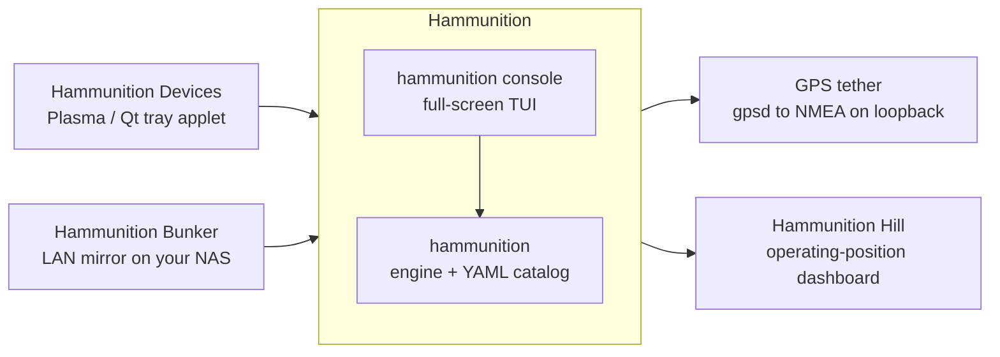
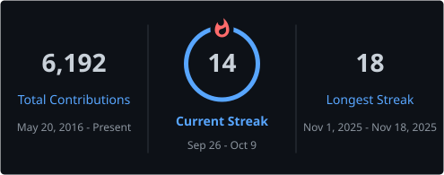

# 👋 Hey, I'm Moshe aka **ChiefGyk3D**

**Cybersecurity Engineer (CISSP) · Linux Nerd · Ham Radio Operator · Open-Source Builder · Content Creator**

I break things, fix things, automate everything, and talk about it on YouTube.

**🔗 All my links:** [links.chiefgyk3d.com](https://links.chiefgyk3d.com)

---

## 🧭 At a glance

| | |
|---|---|
| 🛡️ **Day job** | Cybersecurity engineer working across IAM, EDR, SOAR, ZTNA, SASE, and cloud security. CISSP, primarily self-taught: homelabbing, curiosity, and hands-on experience over formal education. |
| 🐧 **Desktop** | Pop!_OS, Parrot OS, and Debian as daily drivers on hand-built desktops and laptops from Tuxedo Computers, System76, and MNT. Ubuntu on production servers, RHEL-family (Rocky, AlmaLinux, CentOS) at work. |
| 📡 **Radio** | Licensed amateur radio operator. SDR, Meshtastic, LoRa, antenna builds, and a growing toolchain for turning a Linux box into an RF workstation. |
| 🏗️ **Homelab** | pfSense + Suricata at the edge, an OpenSearch/Wazuh SIEM, UniFi networking, a dual-GPU inference box, SBCs everywhere, and as much repurposed hardware as practical. [Details below.](#-my-home-lab-stack) |
| 🌐 **Self-hosted** | My own Mastodon instance, Matrix homeserver, Pixelfed, link aggregator, and more. Bluesky PDS coming soon. |
| 🎥 **Content** | Tutorials, security breakdowns, and livestreams for the next generation of tech and security professionals. |
| 🧠 **Cares about** | End-to-end encryption, zero trust, owning your infrastructure, right to repair, privacy rights, threat modeling, OSINT, and telecom security (SS7, IMSI catchers, Stingrays). |

If you like cybersecurity automation, homelab engineering, decentralized social media, ham radio, or Linux on the desktop, you're in the right place. **Everything I build is open source.**

---

## 🐧 Open-Source Projects

Grouped by what they're for. Every row is a repo you can clone today.

### 📡 Ham radio, RF & time

The **Hammunition** family turns a stock Debian-family install into an amateur radio and SDR workstation, then keeps it fed, controlled, and on time. One engine with its own console, and several small clients that only ever talk to it.

The whole family lives under the [Renegade Penguin](https://github.com/Renegade-Penguin) organization now, because one shared project board and org-wide security settings beat six repos hanging off my personal account, and because a bus factor of one is a problem I'd rather fix before somebody shows up wanting to help maintain it.

| Project | What it does |
|---|---|
| **[Hammunition](https://github.com/Renegade-Penguin/Hammunition)** | Turns an existing Debian-family install into a full amateur radio, SDR, and RF experimentation workstation. A declarative YAML catalog of software and hardware kept strictly separate from the Python engine that installs it: idempotent, `--dry-run` accurate, with a transaction log and honest per-distro capability reporting. Targets Parrot OS, Debian, Ubuntu, Kali, and Raspberry Pi OS. Ships its own full-screen terminal front end, `hammunition console`, which shows what is installed, what is wrong, and what to do next, and runs the engine's own commands for you with every action shown before it runs. |
| **[Hammunition Hill](https://github.com/Renegade-Penguin/hammunition-hill)** | Hammunition builds the shack computer; Hill is what you put on the monitor above it, the high ground you watch the bands from. Six dashboards and twenty-eight panels that run on your own machine, on your own network, and talk to nobody you did not name. A collector polls on a fixed schedule and writes atomic JSON; the web server only ever reads bytes off disk, so no inbound request can steer an outbound fetch. Propagation, space weather, alerts, satellites, and callsign lookup. |
| **[Hammunition Devices](https://github.com/Renegade-Penguin/hammunition-tray)** | Plasma 6 system-tray applet (with a Qt tray for Xfce, LXQt, LXDE, MATE, and Cinnamon) for parking and waking the radio devices Hammunition has catalogued, so a GNSS receiver stops drawing power all day without being unplugged. Also switches GPS services, the machine's radios, and GPS time mode. Never touches sysfs, never runs as root, one polkit prompt per action. |
| **[Hammunition Bunker](https://github.com/Renegade-Penguin/hammunition-bunker)** | Keeps a verified copy of Hammunition's offline data (map regions, elevation tiles, reference files) on a NAS, fresh on a schedule, and serves it on your LAN. A field laptop then installs from the machine in the next room instead of the internet, checking every byte exactly as it would from the publisher. Early: built and tested against a fake engine, not yet run on a real NAS. |
| **[Hammunition GPS tether](https://github.com/Renegade-Penguin/hammunition-gps-tether)** | Serves your GPS receiver's position from gpsd as NMEA on loopback only, for programs that can't talk to gpsd themselves: QMapShack, the offline browser map, and GeoClue so CoMaps knows where you are. Standard library only, runs as you, never as root. |
| **[Mother Ticker](https://github.com/ChiefGyk3D/mother-ticker)** | GPS-disciplined stratum-1 NTP servers on Raspberry Pi 4, built as appliances: chrony steered by kernel PPS from a u-blox receiver, an RTC for a plausible boot time, a status TUI on the unit's own screen and over SSH, metrics export, and a host hardened like something other machines trust for time. Alpha: tested in CI against recorded gpsd and chrony output, not yet on the target hardware. |
| **[SolarStorm Scout](https://github.com/ChiefGyk3D/solarstorm_scout)** | Automated NOAA space-weather bot with real-time alerts for HF propagation, aurora forecasts, D-region absorption, and solar X-ray flux. Live on [Bluesky](https://bsky.app/profile/solarstormscout.bsky.social) and [Mastodon](https://social.chiefgyk3d.com/@solarstormscout). |
| **[Penguin Overlord](https://github.com/ChiefGyk3D/penguin-overlord)** | Multi-feed Discord bot for radio operators and sysadmins: NOAA propagation data, satellite tracking, ham radio contests, grid square calculations, weather alerts, and more. |

### 🛡️ Security, blue team & SOC

| Project | What it does |
|---|---|
| **[Typo Sniper](https://github.com/ChiefGyk3D/typo-sniper)** | Automated typosquatting detection using dnstwist, WHOIS lookups, and cloud automation to identify and alert on look-alike domains before they're used against you. |
| **[Skid Finder](https://github.com/ChiefGyk3D/Skid-Finder)** | Defensive BLE monitoring for conference floors. Detects scripted Bluetooth Low Energy spam and flood tooling, the kind the skids run at DEF CON and BSides, and lets you foxhunt the source. Tuned for the ClockworkPi uConsole, runs on other Linux devices too. |
| **[SIEM Docker Stack](https://github.com/ChiefGyk3D/siem-docker-stack)** | Production-ready, fully Dockerized SIEM/SOC stack with hot/warm tiering for home labs and SMBs: OpenSearch (2-node cluster), Wazuh EDR, Grafana, Logstash, Prometheus, InfluxDB, Syslog-ng, UniFi Poller, and automated setup scripts. The server side of my lab's SIEM. |
| **[pfSense SIEM Stack](https://github.com/ChiefGyk3D/pfsense-siem-stack)** | pfSense deployment, monitoring, and security knowledge base: from basic configuration to SIEM integration, IDS/IPS optimization, and network security automation. The firewall side of the same SIEM. |
| **[JumpCloud Wazuh Bridge](https://github.com/ChiefGyk3D/jumpcloud-wazuh-bridge)** | Forwards and normalizes JumpCloud events into Wazuh pipelines for centralized visibility, correlation, and alerting. |
| **[Patch Gremlin](https://github.com/ChiefGyk3D/Patch-Gremlin)** | Security advisory and OS patch notification bot. Alerts you to critical updates across multiple platforms so nothing sits unpatched because nobody noticed. |
| **[NetPulse](https://github.com/ChiefGyk3D/netpulse)** | Continuous internet connection monitoring (throughput, latency, jitter) with historical tracking, so when the line degrades you have the receipts to hand your ISP. |
| **[git-your-ship-together](https://github.com/ChiefGyk3D/git-your-ship-together)** | The reusable, hardened GitHub Actions workflows shared by my Python projects. Each repo gets lint, tests, a container build, a signed multi-arch release, and six kinds of scan from three short YAML files. Secrets live in Doppler and are fetched over OIDC: not one Actions secret across the fleet. Written to be read if you want to see a hardened CI setup end to end. |
| **[The Great Infocon Recovery](https://github.com/ChiefGyk3D/the-great-infocon-recovery)** | Rebuilds and maintains a local time capsule of the infocon.org archive and DEF CON's media library, preserving decades of hacker history against link rot and quiet deletion. |
| **[Offline Password Generator](https://github.com/ChiefGyk3D/offline_pass_generator)** | Tiny Python script that generates URL-safe random passwords with the `secrets` module. No network, no dependencies, no excuses. |

### 🐧 Linux desktop & hardware

Fixes for the laptops and desktops I actually run, so the next person doesn't have to rediscover them.

| Project | What it does |
|---|---|
| **[FrankenLLM](https://github.com/ChiefGyk3D/FrankenLLM)** | Local AI inference platform combining multiple open-source LLMs behind a unified interface, designed for running several GPUs and models at once. Self-hosted and privacy-focused. Runs my dual-GPU inference box. |
| **[NVIDIA Display Layout](https://github.com/ChiefGyk3D/nvidia-display-layout)** | Deterministic, NVIDIA-native display layout management for X11. Stops multi-monitor arrangements from rearranging themselves every reboot. |
| **[Browser Cleanup Tools](https://github.com/ChiefGyk3D/browser_cleanup_tools)** | Bash scripts that clean cache, sessions, and cruft from Linux browsers and mail clients across native, Flatpak, and Snap installs. v2 adds Betterfox-derived privacy and performance profiles, Chromium policy hardening, GPU-tuned compositor settings, and a profile manager with GPG-encrypted backups. |
| **[NAS Mount Manager](https://github.com/ChiefGyk3D/NAS_Mount_Manager)** | On-demand mounting and unmounting of SMB/CIFS and NFS shares, ideal for laptops that roam. Guided setup wizard, share discovery, status with disk usage, and saved configs. |
| **[dell-battery-balance](https://github.com/ChiefGyk3D/dell-battery-balance)** | Wear tracking and charge-ceiling balancing for the two battery packs (primary + slice) in a Dell Latitude 5430 Rugged, driven by the stock kernel's Dell WMI interfaces. |
| **[Pangolin Keyboard Fix](https://github.com/ChiefGyk3D/system76-pangolin-keyboard-fix)** | Installs System76's drivers and tools on non-Pop!_OS Debian-based distros for the Pangolin laptop: keyboard backlight control, hotkeys, power profiles, and a fix for the keyboard dying after suspend. |
| **[Pipewire Sink](https://github.com/ChiefGyk3D/pipewire_sink)** | Lightweight PipeWire audio sink switcher. Manage and switch between output devices without digging through a settings panel. |
| **[Split Tunnel Switch](https://github.com/ChiefGyk3D/split_tunnel_switch)** | Routes specific applications through different network interfaces or VPN connections. |
| **[Kdenlive Tweaks](https://github.com/ChiefGyk3D/kdenlive-tweaks)** | Setup scripts and configuration for Kdenlive on Linux with GPU acceleration and speech-to-text, tuned for an actual video production workflow rather than a default install. |

### 🎮 Gaming on Linux

| Project | What it does |
|---|---|
| **[Modded OpenMW Build](https://github.com/ChiefGyk3D/morrowind-cg3d)** | Reproducible setup for a modded OpenMW 0.50 Morrowind install on Linux, built on a Tamriel Rebuilt vanilla-plus baseline with a documented, layered mod install order rather than a folder of mystery files. |
| **[Modded Fallout 4 Build](https://github.com/ChiefGyk3D/fallout4-cg3d)** | The same philosophy applied to Fallout 4 on Steam + Proton: fix the bugs, modernize visuals and QoL for the hardware, add faithful content later, never change what the game is. Scripts deploy the whole load order. Testing: research complete, first real playthrough pending. |
| **[Update Proton-GE](https://github.com/ChiefGyk3D/update-proton-ge)** | One script to fetch the latest Proton-GE release, verify its SHA512, and install it into Flatpak or native Steam. Skips the download when you're already current. |

### 📣 Content, streaming & fediverse automation

| Project | What it does |
|---|---|
| **[Hypeman](https://github.com/ChiefGyk3D/hypeman)** | The shared core behind the daemon family. A hype man's whole job is announcing you loudly to a crowd; this library does exactly that for Bluesky, Mastodon, Discord, and Matrix, so the daemons below don't each reinvent posting. |
| **[Stream Daemon](https://github.com/ChiefGyk3D/Stream-Daemon)** | Monitors Twitch, YouTube, and Kick and announces to Mastodon, Bluesky, Discord, and Matrix when you go live or sign off, with optional AI-written messages via Gemini or a local Ollama. |
| **[Boon Tube Daemon](https://github.com/ChiefGyk3D/Boon-Tube-Daemon)** | Watches YouTube channels for new uploads (videos and Shorts, not livestreams) and posts a per-platform announcement to Discord, Matrix, Bluesky, and Mastodon, with configurable tone. |
| **[Star Daemon](https://github.com/ChiefGyk3D/Star-Daemon)** | Posts the repositories you star to Mastodon, Bluesky, Discord, Matrix, and Threads as rich cards, so your followers see what you're reading. |
| **[Mastodon Tweaks](https://github.com/ChiefGyk3D/Mastodon_Tweaks)** | Custom server stylesheets for Mastodon, rebased on Mastodon Bird UI v4.0.0. Posting and appearance variants maintained for my own instance. |
| **[support-me](https://github.com/ChiefGyk3D/support-me)** | The responsive donation page behind [support.chiefgyk3d.com](https://support.chiefgyk3d.com): crypto tips with one-click copy, merch, Patreon, StreamElements, and every social link in one place. |
| **[Email Signature](https://github.com/ChiefGyk3D/email_signature)** | Responsive HTML email signature template with desktop and mobile versions and icons for eleven social platforms. |

### 💰 Finance & planning

| Project | What it does |
|---|---|
| **[Budgeting Tools](https://github.com/ChiefGyk3D/budgeting_tools)** | `finplan`: one command covering budgets, expense tracking, pay calendars, savings goals, debt payoff, mortgages, refinancing, investments, retirement, and net worth, all sharing a single financial engine and the same input validation. |
| **[AInvestment Planner](https://github.com/ChiefGyk3D/AInvestment_planner)** | Fee-aware allocation planner for *small* stock and crypto accounts, where order minimums and spreads matter more than any optimizer. Produces target weights and the exact orders per venue, drops orders too small to be worth their fee, and tells you what the whole thing cost. Never touches your brokerage. Not financial advice. |
| **[Investment Tools](https://github.com/ChiefGyk3D/investment_tools)** | The original grab bag of Python calculators: auto loans, budget planning, compound interest, debt payoff, and more, with charts and Excel output. |
| **[Long Weekend Planner](https://github.com/ChiefGyk3D/Long_Weekend_Planner)** | Finds the long weekends hiding in your calendar and plans a year of PTO around them. Give it the holidays your employer actually observes and your PTO allowance, and it works out which ones are one day away from a four-day break. |

### 🪙 Monero & 😂 just for fun

| Project | What it does |
|---|---|
| **[PiNodeXMR Grafana Dashboard](https://github.com/ChiefGyk3D/PiNodeXMR_Grafana_Dashboard)** | Monero node monitoring for Grafana with a custom monerod exporter: sync status, network hashrate, mempool, peers, and system health for PiNodeXMR devices via Prometheus. |
| **[Yo Mama as a Service](https://github.com/ChiefGyk3D/yomama-as-a-service)** | A humorous API delivering classic "Yo Mama" jokes on demand. Built for fun and for learning API development, and it still gets the full hardened CI treatment. |

---

## 🧪 My Home Lab Stack

Building, breaking, and learning in a production-grade home lab. I prioritize energy efficiency and sustainability by using SBCs and repurposed hardware wherever practical.

### 🔒 Network & security

- **Firewall:** Supermicro E300-8D (Intel Xeon D-1518, 32 GB DDR4 ECC, 256 GB NVMe) running **pfSense** + **Suricata** IDS/IPS + **pfBlockerNG** on VLAN-segmented networks, with dual Intel I226 2.5 GbE NICs added for WAN future-proofing
- **Switching & Wi-Fi:** UniFi managed switches and access points. Telemetry collected by **[UniFi Poller](https://unpoller.com/)** into Grafana/InfluxDB, device logs piped to **Wazuh** for EDR alerting

### 📊 SIEM / SOC server

- **Hardware:** Supermicro SuperServer 5019A-FTN4 (Intel Atom C3758, 8 cores, 64 GB DDR4 ECC)
- **Storage:** 240 GB SATA SSD (OS) · 1 TB NVMe (hot data, 0 to 30 days) · 2 TB SATA SSD (warm data, 30 to 365 days)
- **Stack:** Dockerized OpenSearch (hot/warm cluster), Wazuh EDR, Grafana, Logstash, Prometheus, InfluxDB, Syslog-ng, UniFi Poller, Portainer
- **Repos:** [siem-docker-stack](https://github.com/ChiefGyk3D/siem-docker-stack) (server side) · [pfsense-siem-stack](https://github.com/ChiefGyk3D/pfsense-siem-stack) (pfSense side)

### 🤖 AI inference

- **FrankenLLM server** running dual GPUs: NVIDIA RTX 5060 Ti 16 GB + NVIDIA RTX 3050 8 GB for simultaneous multi-model inference ([repo](https://github.com/ChiefGyk3D/FrankenLLM))

### 🖥️ Compute & storage

- **Single-board computers:** Raspberry Pi (4 & 5), Pine64, and various other devices for power-efficient computing
- **Coming soon:** 5× Pi 5 Kubernetes cluster for container orchestration and bot infrastructure
- **Second-hand PCs** repurposed whenever possible to reduce e-waste
- **Synology NAS** with NUT (Network UPS Tools) monitoring and notifications, soon also hosting a [Hammunition Bunker](https://github.com/Renegade-Penguin/hammunition-bunker) mirror

### 📡 Radio, SDR & time

- **Meshtastic nodes**, LoRa experiments, and custom antenna builds
- **SDR:** ADS-B aircraft tracking, UAT weather, and RF signal analysis
- **Station tooling:** [Hammunition](https://github.com/Renegade-Penguin/Hammunition) builds the workstation, [Hammunition Hill](https://github.com/Renegade-Penguin/hammunition-hill) watches propagation from it
- **In progress:** two GPS-disciplined stratum-1 NTP appliances built from [Mother Ticker](https://github.com/ChiefGyk3D/mother-ticker), one for the main LAN and one for the malware-analysis segment

### 🌐 Self-hosted services

- Mastodon instance, Matrix homeserver, Pixelfed, link aggregator, support page, and more. Bluesky PDS coming soon.

This lab isn't just a playground. It's where I test security tools, practice incident response, and develop the automation I share with the community.

---

## 🎥 Content Creation

**📹 Videos:** [YouTube](https://youtube.com/@ChiefGyk3D) • [TikTok](https://tiktok.com/@chiefgyk3d)
**🔴 Livestreaming:** [YouTube](https://youtube.com/@ChiefGyk3D) • [Twitch](https://twitch.tv/chiefgyk3d) • [Kick](https://kick.com/chiefgyk3d) • [TikTok](https://tiktok.com/@chiefgyk3d)

Educational content focused on giving aspiring tech and cybersecurity professionals practical, real-world knowledge:

- **Linux** as a daily driver and production environment
- **Cybersecurity investigations** and real-world threat and news breakdowns
- **Radio & Meshtastic** communications and mesh networking
- **Endpoint security** and enterprise tooling deep dives
- **Home labs & networking** architecture and implementation
- **Device reviews**, privacy tools, and open-source infrastructure

Whether you're just starting out or leveling up, the goal is content that's accessible, practical, and security-focused.

---

## 📊 GitHub Stats

  
  

  

Generated once a day by <a href="./.github/workflows/readme-cards.yml">a GitHub Action</a> and committed to this repo. Nothing is fetched when you load this page, and nothing can rate limit it.

---

## 🐧 Happy Hacking

Everything I build is open source. Fork anything, send PRs, open issues, or just say hi.
Let's make the internet more secure and fun, one commit at a time. 🛡️

---

🔐 Security | 🐧 Linux | 📡 Radio | 🏗️ Homelab | 🎥 Content

